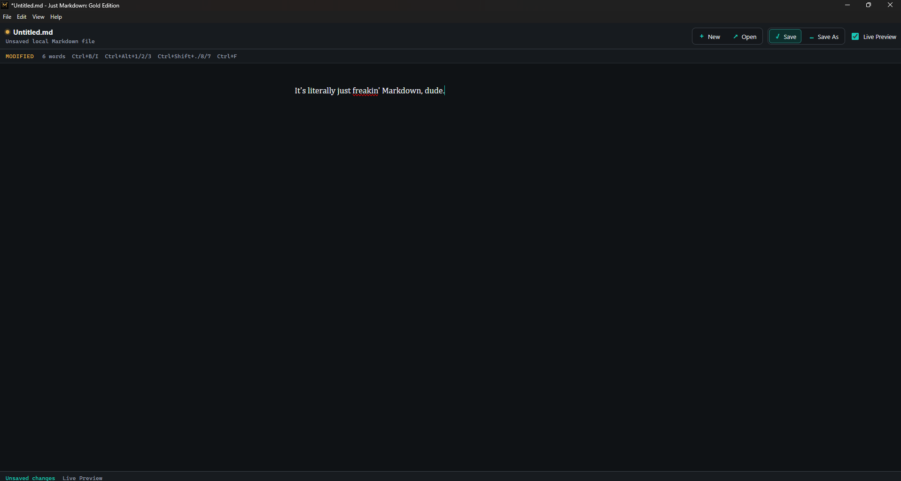

# Just Markdown: Gold Edition

<p align="center">
  
</p>

<p align="center">
  <strong>It's literally just freakin' Markdown, dude.</strong>
</p>

Just Markdown: Gold Edition is a small local Markdown editor for Windows.

That is the whole pitch. Ever try to open a Markdown file and Obsidian says, "nope, that's not a vault"? Or VS Code starts warming up the whole aircraft carrier because you clicked one `.md` file? This is for that moment.

Open Markdown. View Markdown. Edit Markdown. Save Markdown. No vault ceremony, no project indexing, no dicking around.

Gold Edition is the joke. The editor is sincere.



## What It Is

- A lightweight Windows desktop editor for ordinary `.md` and `.markdown` files.
- A companion app for people who already use Obsidian, VS Code, or other heavier tools but sometimes just want the file.
- A pleasant live-preview writing surface backed by plain Markdown on disk.
- Direct Open, Save, Save As, Recent Files, and Windows file association support.
- Toolbar buttons for common Markdown formatting: bold, italic, headings, quote, lists, and find.
- Menu-level reading controls for font size, line width, and five themes.
- Unsaved-change prompts and a simple recovery draft so daily use feels less haunted.
- A tool that gets out of the way before it starts calling itself a second brain.

## What It Is Not

- Not a notes system.
- Not a vault.
- Not a PKM graph.
- Not a plugin platform.
- Not a publishing workflow.
- Not a lifestyle choice.
- Not coming for your folders.
- Not basically every vibe-coded Markdown viewer from `/r/markdown`.

## Current Shape

Markdown stays the on-disk source of truth. Live Preview hides common Markdown marks while rendering prose styling, and raw marks reveal at the cursor so editing remains honest.

The app exposes the daily actions directly: file commands, basic Markdown formatting, Find, and Live Preview. The native View menu keeps the quiet reading preferences: themes, Smaller / Default / Larger font size, and Narrow / Standard / Wide reading width.

Themes are intentionally small-scope except when they are not: Gold Standard, Midnight, Evergreen, Paper, and Power User. Power User goes full Apple II energy, including the monospace font.

Version `0.3.0` is the current packaged Windows release: README, license, changelog, screenshot, refreshed installer, app-owned recent files, recovery drafts, toolbar formatting, reading preferences, themes, and enough Windows file-open confidence to stop flinching every time Explorer gets involved.

See [docs/PRODUCT_PLAN.md](docs/PRODUCT_PLAN.md) and [docs/UI_AND_FUNCTIONS.md](docs/UI_AND_FUNCTIONS.md) for the intentionally small scope.

## Development

Requirements:

- Node.js and npm.
- Windows for the Electron desktop shell and installer work.

Run the app in development:

```powershell
npm install
npm run dev
```

Run a production renderer build:

```powershell
npm run build
```

## Package

Build the Windows installer:

```powershell
npm run dist
```

The installer is written to `release/` and is intentionally ignored by Git. Publish installers through GitHub Releases rather than committing generated binaries.

Windows file associations for `.md` and `.markdown` are configured in `package.json` through `electron-builder`.

## Platform Roadmap

| Platform | Status |
| --- | --- |
| Windows | Supported with NSIS installer. Latest local packaged release is `0.3.0`. |
| macOS | Planned for `0.4.0` with DMG/ZIP builds. Signing and notarization can follow. |
| Linux | Planned for `0.4.0` with AppImage and Flatpak builds. |
| Android | Not an Electron target. Future experiment, mostly for the smartfridge joke. |

Will it run on a smartfridge? If the fridge runs Linux, Android, or a browser and has opinions about Markdown, probably eventually.

## License

MIT. Do what you need. Try not to turn it into a graph database with a toolbar.
